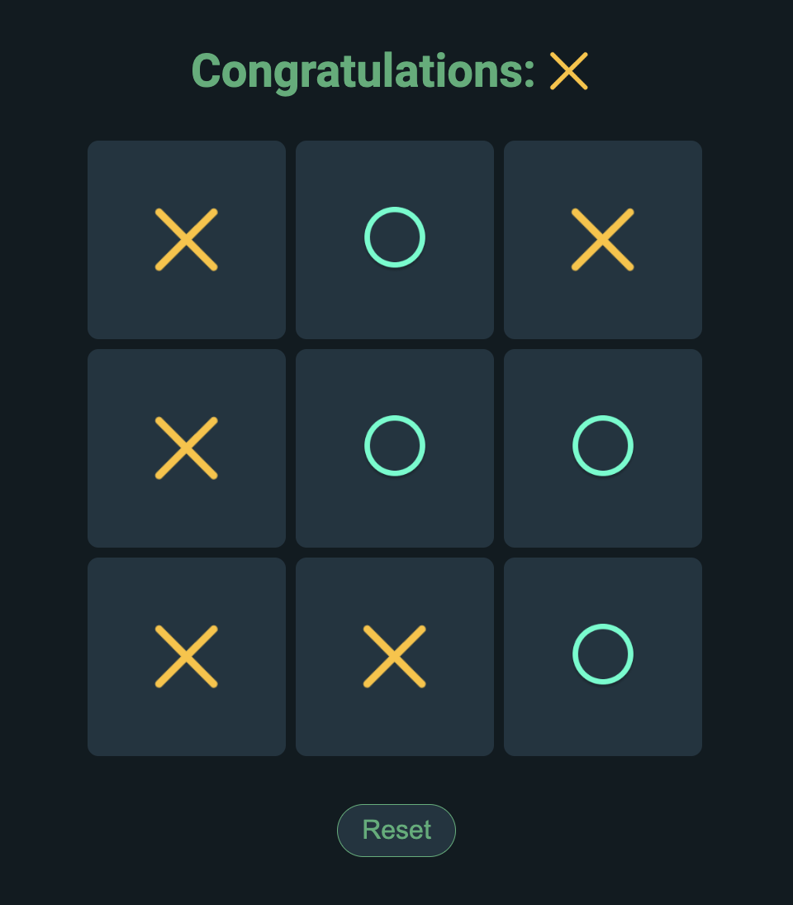

<h2>About the project</h2>

  
The Tic Tac Toe game is a simple two-player game where each player takes turns marking a 3x3 grid with their respective symbol (X or O). The first player to get three of their symbols in a row (horizontally, vertically, or diagonally) wins the game. If all nine squares are filled without any player achieving three in a row, the game is considered a draw.

  <h3>Key Features</h3>
  <ul>
  <li>Interactive UI: The game board is a 3x3 grid of clickable squares</li>
  <li>Player Turns: The game alternates between two players, X and O</li>
  <li>Winning Logic: The game detects when a player has won or when the game is a draw</li>
  <li>Reset Option: Players can reset the game to start over</li>
  </ul>

👉 Live Demo: <a href='https://sanjayvjacob.github.io/tictactoe-react/'>Live Demo</a>

<h3>Build with: React</h3>

<h3>Screenshot</h3>
 

